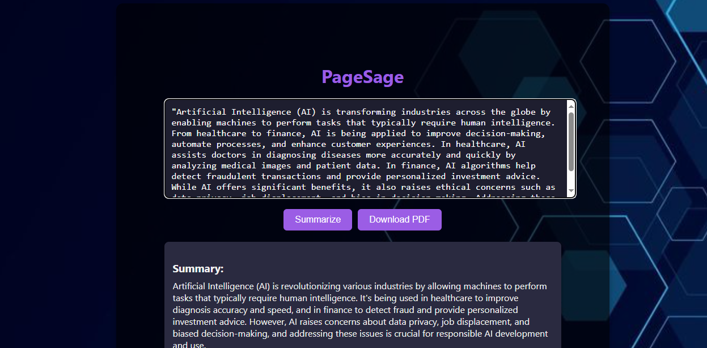

# PageSage 

PageSage is a simple **AI-powered text summarizer** built with **React (frontend)** and **Flask (backend)**.  
It uses the **Groq API** to generate concise summaries of long text and lets you download the results as a PDF.  

---

## ✨ Features
- Paste any text and get a short, clear summary  
- Backend powered by Flask  
- Frontend built with React  
- AI summarization through Groq API  
- Option to download the summary as a PDF  
- Clean and minimal UI  

---

## 📂 Project Structure
- **frontend/** → React app (user interface)  
- **backend/** → Flask API (handles summarization + PDF)  
- **backend/app.py** → Main backend file  
- **backend/utils/** → Helper functions  
- **.env** → Stores your Groq API key (not committed)  
- **.gitignore** → Hides `.env`, node_modules, venv, etc.  

---

## 🖼️ Screenshots
Save your screenshots in a `screenshots/` folder at the root of the project:  

- Backend running →   
- Frontend UI →   
- Example summary →   
- Download as PDF →   

---

## ⚙️ Setup Instructions

### 1. Clone the Repository
```bash
git clone https://github.com/your-username/PageSage.git
cd PageSage


### 2. Backend Setup
cd backend
python -m venv venv
venv\Scripts\activate   # Windows
# or: source venv/bin/activate   # Mac/Linux
pip install -r requirements.txt

Create a .env file inside backend/:
GROQ_API_KEY=your_api_key_here

Run the backend:
python app.py
➡️ Backend runs at: http://127.0.0.1:5000/

3. Frontend Setup
cd frontend
npm install
npm start


➡️ Frontend runs at: http://localhost:3000/

🚀 Usage

Start backend (port 5000) and frontend (port 3000)

Paste text into the input box

Click Summarize to get the summary

Click Download PDF to save it.